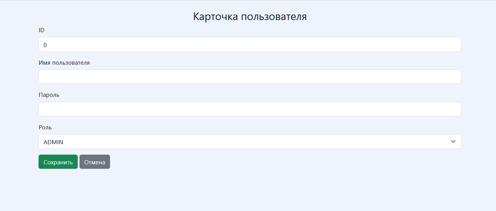

# Веб-приложение учёта сотрудников
Реализованное приложение позволяет пользователю работать с данными сотрудников гипотетической компании прямо в браузере - удалять, добавлять, просматривать и изменять уже существующих работников в базе данных. Помимо этого в приложении реализована система безопасности, разграничивающая возможности пользователей с разными ролями. Так, например, гости могут только просматривать данные сотрудников, тогда как администраторы могут практически всё - начиная с работы с данными сотрудников, заканчивая просмотром и манипуляциями с существующими пользователями.
# Использованные технологии
Программа была создана с использованием:
* IntelliJ IDEA
* Java
* HTML
* Thymeleaf
* Spring (Spring Boot, Spring Core, Spring MVC, Spring Data JPA, Spring Security)
* PostgreSQL
* JPA/Hibernate
# Установка и запуск
1. Скачать и распаковать архив  WebEmployeeManagmentSystem из [релизов](https://github.com/qwert312/Web-Employee-Management-System/releases/latest).
2. Создать и заполнить базу данных из скрипта emsDump.sql, выполнив его в PostgreSql.
3. (Опционально) Поменять под себя свойства в файле application.properties, если необходимо.
4. Запустить WebEmployeeManagementSystem-1.0.0-SNAPSHOT.jar

Дальше доступ к страницам веб-приложения можно получить через стандартный localhost:8080. Например localhost:8080/login для доступа к логин-форме
# Использование
Для работы с приложением в первую очередь необходимо пройти аутентификацию через логин-форму. Если в базе данных пока не хранится какой-либо юзер, то в неё по умолчанию добавляется администратор с username admin и паролем admin

&ensp;

После аутентификации юзер попадает на приветственную страницу, с которой он, если является администратором, может попасть на страницу пользователей, сотрудников, а также в свой профиль. К тому же он может завершить текущий аутентификационный сеанс с помощью кнопки "Выйти". Тогда он снова попадёт на страницу логин-формы.

&ensp;

Обычный пользователь имеет доступ к таким же страницам, за исключением страницы пользователей.

&ensp;

На странице сотрудников пользователь имеет все те же возможности по навигации, что и с приветственной страницы. На ней он может увидеть карточки сотрудников, хранящихся в базе данных. На них отображены имя-фамилия сотрудника и его должность, а также кнопки удаления и просмотра (с возможность редактирования) сотрудника. На странице реализована система пагинации, отображающая за раз только 12 сотрудников. Для просмотра следующей группы работников пользователю необходимо переместиться с помощью панели пагинации на следующую страницу. Помимо возможности работы с существующими сотрудниками, прямо под навигационной панелью расположена кнопка добавления нового сотрудника. Функционал, связанный с изменением/добавлением/удалением данных, доступен только администратору.

&ensp;

Обычный пользователь видит тот же самый контент на странице работников, за исключением отсутствия элементов, связанных с изменением/добавлением/удалением данных.

&ensp;

В форме добавления/изменения сотрудника отображаются все возможные поля сущности сотрудника из базы данных. Если пользователь зашёл как администратор и открыл форму через кнопку добавления сотрудника, то все поля по умолчанию пустые и пользователю нужно заполнить их для добавления нового работника (кроме поля ID - оно генерируется БД уже самостоятельно, если нулевое). В ином же случае в поля подставляются данные выбранного сотрудника, которые можно изменить (опять же - за исключением ID) и сохранить, если пользователь администратор. Полям должности/отдела/рабочего статуса допускают только определённые варианты значений, которые пользователь может выбрать.

&ensp;

Обычный пользователь может попасть только на форму просмотра сотрудника, где он не может ничего редактировать и сохранять.

&ensp;

На странице пользователей пользователь имеет все те же возможности по навигации, что и с приветственной страницы. На ней он может увидеть карточки пользователей, хранящихся в базе данных. На них отображены логин и роль пользователя, а также кнопки просмотра и удаления. Текущий аутентифицированный пользователь помечается специальной надписью, на его карточке отсутствуют кнопки удаления и просмотра. Система пагинации реализована идентичным со страницей сотрудников образом. Под навигационной панелью также присутствует кнопка добавления нового пользователя. Страница пользователей и все открывающиеся из неё формы доступны только администратору.

В форме добавления/просмотра пользователя отображаются все возможные поля сущности пользователя с одной оговоркой - на вкладке просмотра поле пароля не отображается. Если пользователь открыл форму через кнопку добавления пользователя, то все поля по умолчанию пустые и пользователю нужно заполнить их для добавления нового юзера (кроме поля ID - оно генерируется БД уже самостоятельно, если нулевое). В ином же случае в поля подставляются данные выбранного юзера (за исключением пароля - он хранится в БД в зашифрованном виде и нигде в приложении не отображается, поэтому его поле остаётся пустым). Поле роли допускает только определённые варианты значений, которые пользователь может выбрать.

&ensp;

На странице профиля отображается в виде формы данные по текущему пользователю. Их можно изменить и сохранить (за исключением роли). После сохранения изменений текущий аутентификационный сеанс завершается и пользователь попадает на страницу логин-формы.

